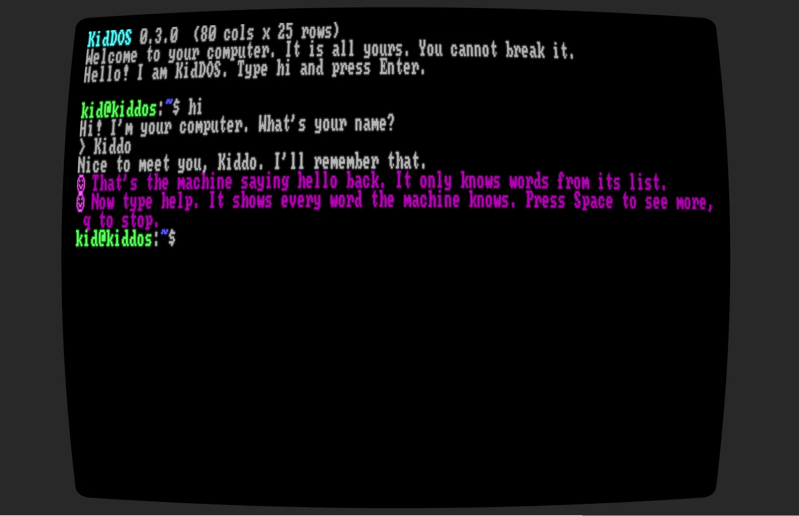
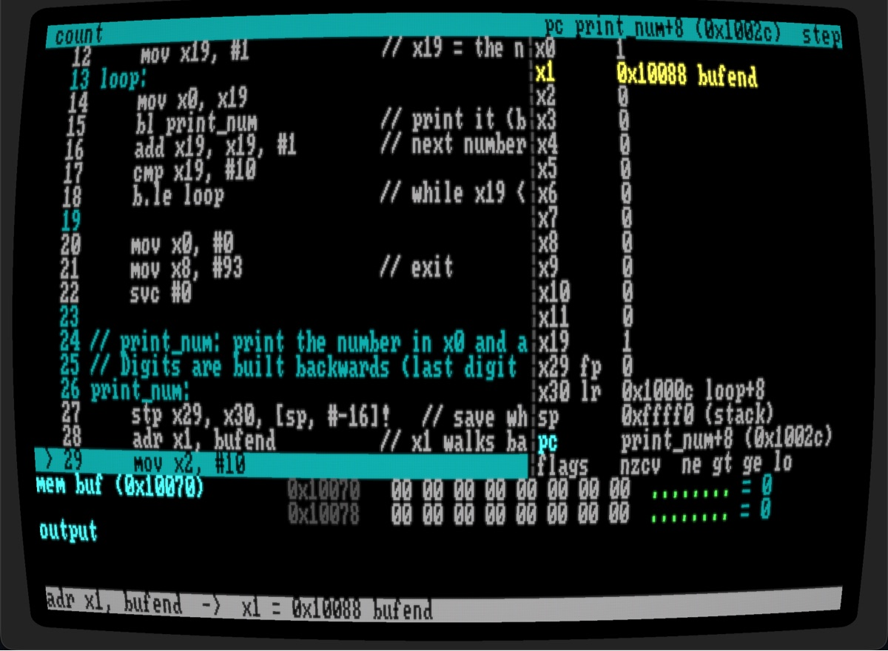

# KidDOS

**A computer small enough for a kid to explore.**

Website: **[kiddos.dev](https://kiddos.dev)** · Download: **[kiddos.dev/download](https://kiddos.dev/download/)** · Parents: **[read this first](docs/PARENTS.md)**

KidDOS is a fantasy computer inside your real one. A single native app opens
fullscreen and shows a retro machine: a CRT terminal, a Unix-flavored shell, a
virtual hard drive, a manual, BASIC, sandboxed C and Go, pixel graphics, ARM
assembly with a debugger, and games whose source the kid can read and change.
There is no internet, no host filesystem, no mouse. A child types `hi` and the
machine talks back.

For children about 7 to 13. Free, open source, Mac, Windows and Linux
(including Raspberry Pi).

<p align="center">
  
</p>

## Download

Prebuilt binaries live at **[kiddos.dev/download](https://kiddos.dev/download/)**,
one zip per platform, with SHA-256 checksums:

| Platform | What you get |
|---|---|
| macOS (Apple Silicon and Intel) | One universal app, signed and notarized by Apple |
| Windows 10/11 x64 | A zip with `kiddos.exe` (not signed yet: choose "More info", then "Run anyway") |
| Linux x64 and ARM64 | A tarball with the binary (`chmod +x kiddos`; needs ALSA and X11 or Wayland) |

The same page has the optional **C and Go toolchain packs** (the compilers are
big, so the app ships without them; a parent installs a pack from parent mode)
and the **Doom cartridge**, the real 1993 engine with Freedoom's levels,
installed the same way.

No installer: unzip it, open it, type `hi`. It goes fullscreen on purpose and
is meant to be hard to leave by accident. **Read [docs/PARENTS.md](docs/PARENTS.md)
before a child sits down**: it says how to start it, set the parent password,
and get out. The same page is inside every download as `READ-ME-FIRST-PARENTS.md`.

## What is inside (v0.7)

- **A real shell.** `ls`, `cd`, `cat`, `mkdir`, `rm`, pipes, redirects,
  globbing, history, tab completion. Unknown commands get "Did you mean `ls`?",
  never an error code. Unix vocabulary throughout, so it transfers to a real
  terminal later.
- **A virtual drive.** One SQLite file. The kid can `rm -rf` the whole thing
  and the only consequence is a lesson; a parent resets it with one command.
- **A manual.** `man ls` works, and so does `man -k`. Every page is written
  for a child, with a "grown-up note" on how the real thing differs.
- **Fourteen lessons with a tutor** that watches what the kid types and nudges
  one line at a time: hello, folders, files, pipes, editing, scripts,
  variables, a first program, a first game, what a CPU does, find the bug.
- **BASIC and an editor.** EndBASIC bound to the screen and the drive, with
  `SPEAK`, `BEEP`, `KEY$`, `PUT`, `SCREEN 13` and the `GFX_` words. `edit`
  opens any file; `newgame rocket` scaffolds a cartridge.
- **C and Go, sandboxed.** `cc` and `goc` compile to WebAssembly and run under
  wasmtime with memory and time limits. Ctrl-C works even in a tight loop.
- **Pixels.** 320x200 in 256 colors, double-buffered, from BASIC, C or Go.
  Paint is written in BASIC so a kid can read it. Doom runs as a cartridge.
- **ARM assembly and a debugger.** `as` assembles a real AArch64 subset,
  `./prog` runs it, `debug prog` steps it one instruction at a time with the
  registers and memory on screen, `dis` and `hexdump` show the bytes. Linux
  system call numbers, so what a kid learns here is true on a Raspberry Pi.
- **vi, earned.** A real modal editor, locked at first. Prison Escape teaches
  `:q!`, vi-quest teaches the rest, and `/bin/vi` appears when the kid finishes.
- **Twelve cartridges** the kid can take apart: a cave adventure whose rooms
  are folders, guess, snake, hangman, typing, tetris, sokoban and paint in
  BASIC, rogue in C, prison-escape and vi-quest, and bug-hunt, eight tiny
  assembly programs with one bug each. Doom is a thirteenth a parent installs.
- **`/dev/speaker`.** `echo "I am a robot" > /dev/speaker` makes the computer
  talk. That one line keeps a seven-year-old busy for an hour.
- **Parent mode.** A password-protected chord. Exit fullscreen, reset the
  drive, read the log, install or share cartridges. Nothing else crosses to
  the real machine.

<p align="center">
  
</p>

## Build from source

You need [Rust](https://rustup.rs) 1.85 or newer. The first build takes a few
minutes; after that it starts in a second.

```bash
git clone https://github.com/nurked/kiddos
cd kiddos
cargo run --release -p kiddos
```

Start windowed instead of fullscreen while developing:

```bash
KIDDOS_WINDOWED=1 cargo run -p kiddos
```

Keep the drive somewhere other than the default app-support directory:

```bash
KIDDOS_HOME=/tmp/kiddos-dev cargo run -p kiddos
```

The parent chord is **Ctrl+Alt+Shift+P** (Cmd works as Ctrl on macOS). Parent
mode can `exit-fullscreen`, `reset-drive`, `set-name`, `passwd`, read the `log`,
`shutdown`, and move games in and out: `carts`, `install`, `uninstall`, `share`.
Cartridges are `.kdc` files (plain zips) in the app's `carts/` folder next to the
drive, the only place files cross between the fake machine and the real one.

Release builds: `tools/release.sh` makes the signed macOS app,
`tools/release-docker.sh` the Linux and Windows binaries, `tools/mkpack.sh` and
`tools/mkpack-go.sh` the toolchain packs, `carts/doom/build.sh` the Doom
cartridge.

## Poke at it without a window

```bash
cargo run -p kiddos-headless -- -
```

Type commands; the 80x25 screen is printed after each one. Scripts of
keystrokes (with `{tab}`, `{up}`, `{ctrl-c}` tokens) run with
`cargo run -p kiddos-headless -- script.txt`; the same harness drives the
integration tests in `tools/headless/tests`.

## Test

```bash
cargo test --workspace
```

The assembler's encodings are also checked word for word against a real
`clang -target aarch64-linux-gnu` when one is on the machine.

## Documentation

- [kiddos-plan.md](kiddos-plan.md): the whole plan, phase by phase, with what was decided and why
- [docs/ARCHITECTURE.md](docs/ARCHITECTURE.md): how it is built, layer by layer
- [docs/cartridges/](docs/cartridges/README.md): the cartridge format and a walkthrough of every shipped game
- [docs/PACKS.md](docs/PACKS.md): how the C and Go compilers are packaged
- [docs/PARENTS.md](docs/PARENTS.md): the parent chord, the password, where the files are
- [docs/KID-SESSION.md](docs/KID-SESSION.md): what to watch when a kid sits down
- [content/factory-drive/usr/share/man/en/](content/factory-drive/usr/share/man/en): the manual, as the kid reads it
- [content/factory-drive/lessons/en/](content/factory-drive/lessons/en): the fourteen lessons the tutor follows
- [kiddos.dev/how-to-teach-kids-programming](https://kiddos.dev/how-to-teach-kids-programming/): the guide for parents

## Layout

```
crates/kiddos-console   cell grid, pixel buffer, keys, the Console API contract
crates/kiddos-vfs       inode tree, Unix modes, SQLite image, factory import
crates/kiddos-kernel    processes, pipes, capabilities, host bridge
crates/kiddos-shell     ksh: lexer, parser, expansion, line editor, executor
crates/kiddos-builtins  every command, one file per group
crates/kiddos-man       Markdown man renderer, lookup, search, pager
crates/kiddos-tutor     lesson state machine (TOML lessons, ~/.progress, badges)
crates/kiddos-cart      cartridge manifest, launching, .kdc pack/unpack, install/share
crates/kiddos-basic     EndBASIC 0.12 bound to the console and drive; SPEAK, BEEP, KEY$, TICK, PUT, GFX
crates/kiddos-wasm      wasmtime sandbox: the `kiddos` import module, a WASI subset, `wasm`, `cc`, `goc`
crates/kiddos-vi        the vi engine, `vi` (locked until earned), vi-quest, prison-escape
crates/kiddos-arm       AArch64 subset: emulator, assembler, disassembler, `debug`, bug-hunt
crates/kiddos-i18n      Fluent-syntax string bundles (English today; i18n-ready)
crates/kiddos-render    wgpu renderer with the CRT shader
crates/kiddos-host      window, keys, speech, sound, config dir, parent password
app/                    the binary (embeds the factory drive at build time)
content/factory-drive   what the kid sees on first boot: /etc, /home/kid, man pages, lessons, games
carts/doom              the Doom cartridge: platform layer and build script
tools/headless          no-window machine + test harness
tools/mkdrive           content dir → drive.kdd
tools/release.sh        macOS universal app, signed and notarized
tools/release-docker.sh Linux and Windows binaries in a local container
tools/mkpack.sh         wasi-sdk or LLVM → c-<os>-<arch>.kdp
tools/mkpack-go.sh      TinyGo + GOROOT + wasm-opt → go-<os>-<arch>.kdp
```

## Built on

[EndBASIC](https://www.endbasic.dev/), [wasmtime](https://wasmtime.dev/),
[wgpu](https://wgpu.rs/) and [winit](https://github.com/rust-windowing/winit),
[SQLite](https://sqlite.org/), [clang](https://clang.llvm.org/) with
[wasi-sdk](https://github.com/WebAssembly/wasi-sdk), [TinyGo](https://tinygo.org/),
[doomgeneric](https://github.com/ozkl/doomgeneric) and
[Freedoom](https://freedoom.github.io/).

## License

MIT or Apache-2.0, your choice: [LICENSE-MIT](LICENSE-MIT),
[LICENSE-APACHE](LICENSE-APACHE). Cartridges you make are yours.
